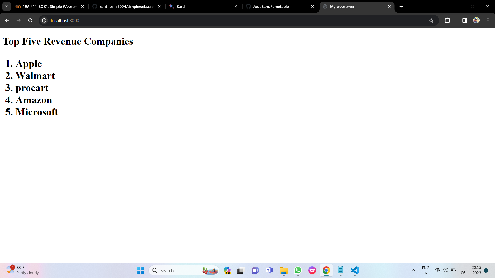
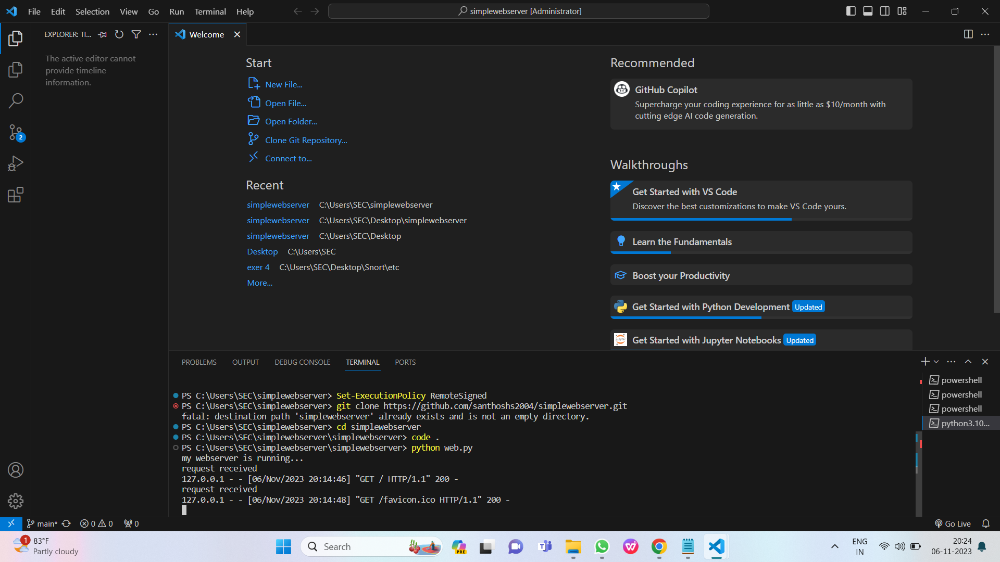

# Developing a Simple Webserver
## Date: 06.11.2023

## AIM:
To develop a simple webserver to serve html pages.

## DESIGN STEPS:
### Step 1: 
HTML content creation
### Step 2:
Design of webserver workflow
### Step 3:
Implementation using Python code
### Step 4:
Serving the HTML pages.
### Step 5:
Testing the webserver

## PROGRAM:
```
from http.server import HTTPServer, BaseHTTPRequestHandler

content = """
<!DOCTYPE html>
<html>
<head>
<title>My webserver</title>
</head>
<body>
<h1>Top Five Revenue Companies<h1>
<ol>
    <li>Apple</li>
    <li>Walmart</li>
    <li>procart</li>
    <li>Amazon</li>
    <li>Microsoft</li>
</ol>
</body>
</html>
"""

class myhandler(BaseHTTPRequestHandler):
    def do_GET(self):
        print("request received")
        self.send_response(200)
        self.send_header('Content-type','text/html; charset=utf-8')
        self.end_headers()
        self.wfile.write(content.encode())
server_address = ('',8000)
httpd = HTTPServer(server_address,myhandler)
print("my webserver is running...")
httpd.serve_forever()
```
## OUTPUT:






## RESULT:
The program for implementing simple webserver is executed successfully.
